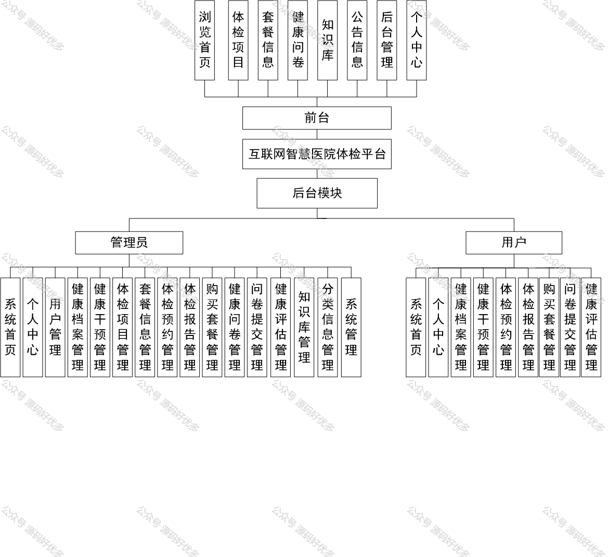
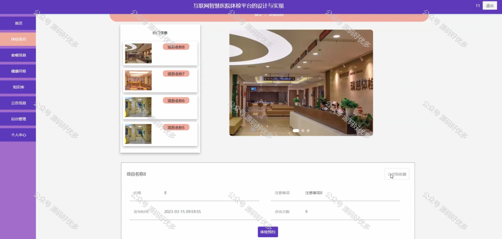
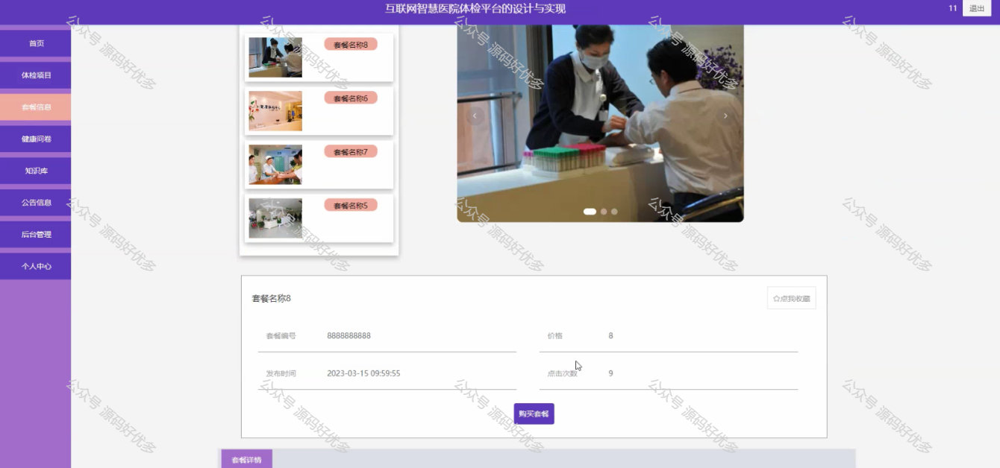
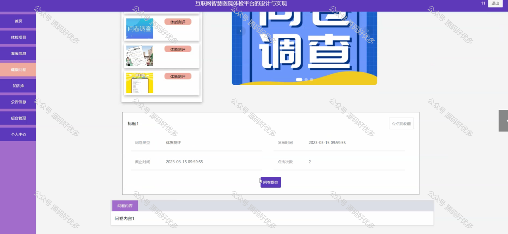
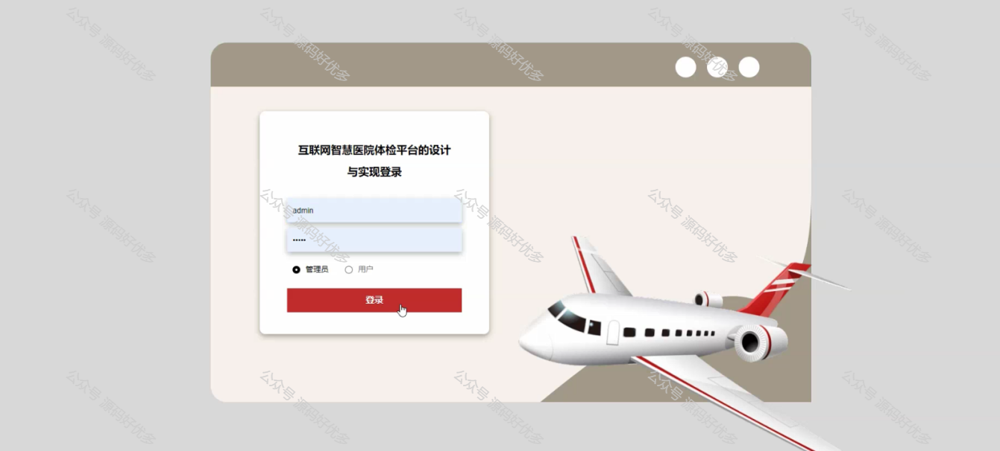
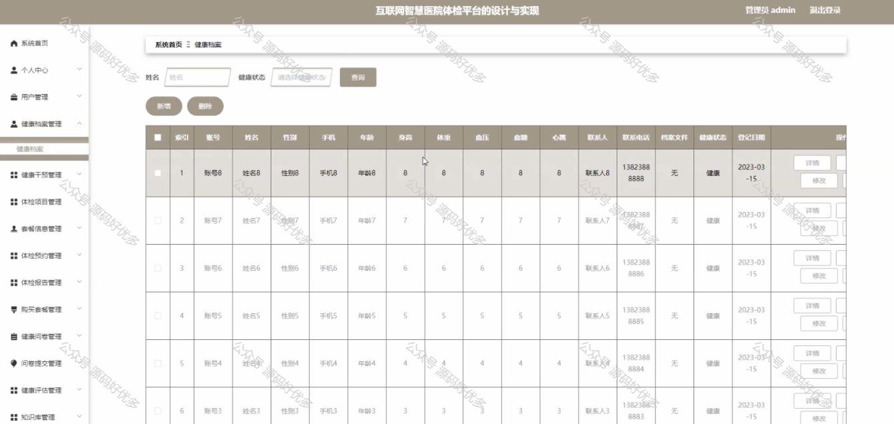
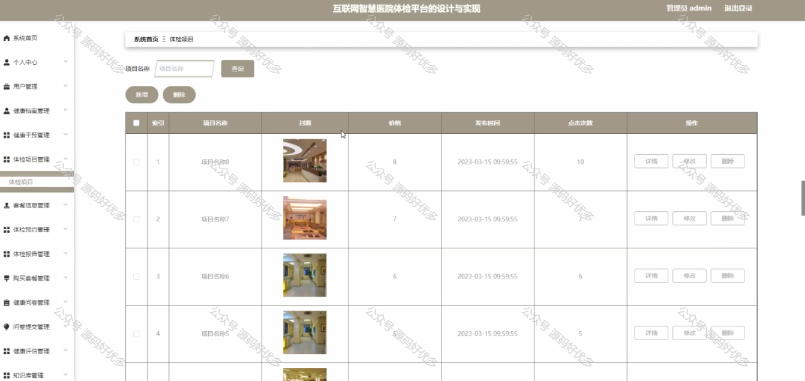
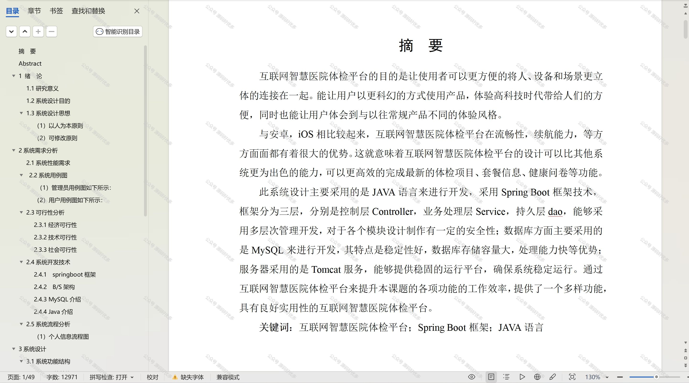

 
## 查看主页获取源码

### 一、作品包含

源码+数据库+设计文档万字+PPT+全套环境和工具资源+部署教程

### 二、项目技术

前端技术：Html、Css、Js、Vue、Element-ui

数据库：MySQL

后端技术：Java、Spring Boot、MyBatis

  

### 三、运行环境

开发工具：IDEA/eclipse

数据库：MySQL5.7

数据库管理工具：Navicat10以上版本

环境配置软件： JDK1.8+Maven3.6.3

前端Nodejs：14

### 四、项目介绍
项目编号：springbootA192

在当今社会，随着人口老龄化加剧和慢性疾病发病率上升，公众对健康体检的需求日益增长，同时对体检服务的质量和效率提出了更高要求。在此背景下，智慧医院体检平台的研究显得尤为重要。本研究立足于当前医疗体检服务面临的挑战，探讨智慧医院体检平台的构建与实施，旨在通过整合现代信息技术，来优化体检流程、提高服务质量、增强用户体验，并推动体检服务向智能化、个性化和精准化方向发展，为提升国民健康水平提供有力支持。

前台用户功能：浏览首页、体检项目、套餐信息、健康问卷、知识库、公告信息、后台管理、个人中心

后台分为管理员和用户
管理员的功能：系统首页、个人中心、用户管理、健康档案管理、健康干预管理、体检项目管理、套餐信息管理、体检预约管理、体检报告管理、购买套餐管理、健康问卷管理、问卷提交管理、健康评估管理、知识库管理、分类信息管理以及系统管理。
用户的功能：系统首页、个人中心、健康档案管理、健康干预管理、体检预约管理、体检报告管理、购买套餐管理、问卷提交管理、健康评估管理。

### 五、运行截图

  
